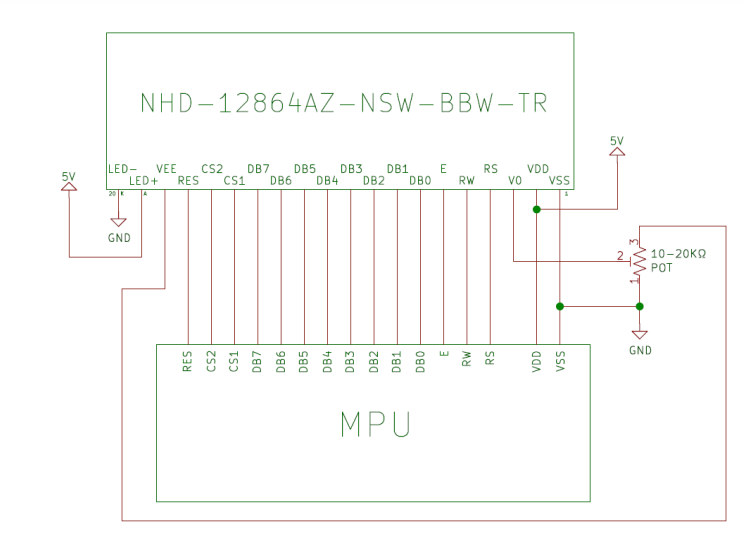
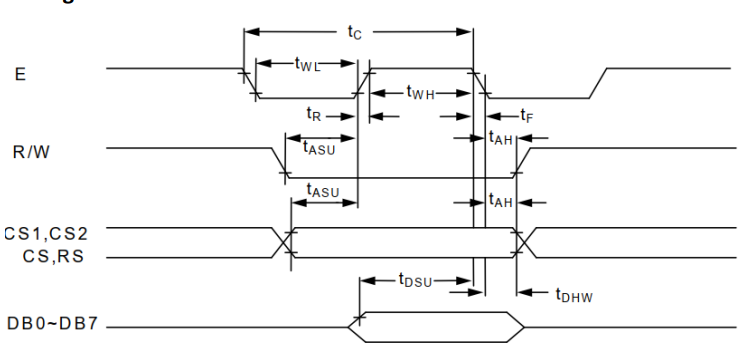

# Documentación del Proyecto
---
Nombre del estudiante:  Juan Diego Arturo
ID: 000473366
---
# Proyecto Driver

### Conexiones del Display

El display de la tarjeta es un "Graphic Liquid Crystal Display Module" con referencia _NHD-12864AZ-NSW-BBW-TR_.

Primero, conecté el led de retroiluminación y los pines que controlan el contraste de la tarjeta según la hoja de datos como en la siguiente imagen. El led se conecta directamente a VDD y VSS. Mientras que V0 se conecta al terminal central de un potenciometro de 10k ohm y los otros dos terminales se conectan a VEE y VSS.





De esta forma, logré encender el LCD y controlar el contraste.

Los otros pines los conecté de la siguiente forma, según lo programé en el archivo _pin_mux.h_

```
// Puerto E
#define BOARD_INITPINS_GPIOE GPIOE 
#define BOARD_INITPINS_PORTE PORTE 

#define BOARD_INITPINS_RST 12U    
#define BOARD_INITPINS_CS1 3U
#define BOARD_INITPINS_CS2 14U

// Puerto D

#define GPIO_DATA_GPIOD GPIOD
#define GPIO_DATA_PORT PORTD

#define BOARD_INITPINS_LCD_DB0 10U
#define BOARD_INITPINS_LCD_DB1 11U
#define BOARD_INITPINS_LCD_DB2 12U
#define BOARD_INITPINS_LCD_DB3 13U
#define BOARD_INITPINS_LCD_DB4 14U
#define BOARD_INITPINS_LCD_DB5 15U
#define BOARD_INITPINS_LCD_DB6 16U
#define BOARD_INITPINS_LCD_DB7 17U

#define BOARD_INITPINS_LCD_RW 6U
#define EN_PIN 7U

// Puerto C

#define BOARD_INITPINS_GPIOC GPIOC
#define BOARD_INITPINS_PORTC PORTC

#define RS_PIN 15U
```

Luego, en _pin_mux.c_ se confuguran los mux para los pines en la función BOARD_InitPins(), usando una definición preva de salida para los mux

```c
void BOARD_InitPins(void)
{
    /* Clock Control: Clock enabled */
    CLOCK_EnableClock(kCLOCK_PortA);
    /* Clock Control: Clock enabled */
    CLOCK_EnableClock(kCLOCK_PortE);

    gpio_pin_config_t Salida_config = {
            .pinDirection = kGPIO_DigitalOutput,
            .outputLogic = 0U
        };

   /* gpio_pin_config_t Entrada_config = {
             .pinDirection = kGPIO_DigitalInput,
    		 .outputLogic = 0U
        };*/


    GPIO_PinInit(GPIO_DATA_GPIOD, BOARD_INITPINS_LCD_DB0, &Salida_config);
    GPIO_PinInit(GPIO_DATA_GPIOD, BOARD_INITPINS_LCD_DB1, &Salida_config);
    GPIO_PinInit(GPIO_DATA_GPIOD, BOARD_INITPINS_LCD_DB2, &Salida_config);
    GPIO_PinInit(GPIO_DATA_GPIOD, BOARD_INITPINS_LCD_DB3, &Salida_config);
    GPIO_PinInit(GPIO_DATA_GPIOD, BOARD_INITPINS_LCD_DB4, &Salida_config);
    GPIO_PinInit(GPIO_DATA_GPIOD, BOARD_INITPINS_LCD_DB5, &Salida_config);
    GPIO_PinInit(GPIO_DATA_GPIOD, BOARD_INITPINS_LCD_DB6, &Salida_config);
    GPIO_PinInit(GPIO_DATA_GPIOD, BOARD_INITPINS_LCD_DB7, &Salida_config);

    GPIO_PinInit(GPIO_DATA_GPIOD, BOARD_INITPINS_LCD_RW, &Salida_config);

    GPIO_PinInit(GPIO_DATA_GPIOD, EN_PIN, &Salida_config);

    GPIO_PinInit(BOARD_INITPINS_GPIOE,BOARD_INITPINS_CS2, &Salida_config);
    GPIO_PinInit(BOARD_INITPINS_GPIOE,BOARD_INITPINS_CS1, &Salida_config);

    GPIO_PinInit(BOARD_INITPINS_GPIOE,BOARD_INITPINS_RST, &Salida_config);

    GPIO_PinInit(BOARD_INITPINS_GPIOC, RS_PIN, &Salida_config);


    /* PORTE*/
    PORT_SetPinMux(BOARD_INITPINS_PORTE, BOARD_INITPINS_RST, kPORT_MuxAsGpio);
    PORT_SetPinMux(BOARD_INITPINS_PORTE, BOARD_INITPINS_CS1, kPORT_MuxAsGpio);
    PORT_SetPinMux(BOARD_INITPINS_PORTE, BOARD_INITPINS_CS2, kPORT_MuxAsGpio);

    /* PORTD*/
    PORT_SetPinMux(GPIO_DATA_PORT, BOARD_INITPINS_LCD_DB0, kPORT_MuxAsGpio);
    PORT_SetPinMux(GPIO_DATA_PORT, BOARD_INITPINS_LCD_DB1, kPORT_MuxAsGpio);
    PORT_SetPinMux(GPIO_DATA_PORT, BOARD_INITPINS_LCD_DB2, kPORT_MuxAsGpio);
    PORT_SetPinMux(GPIO_DATA_PORT, BOARD_INITPINS_LCD_DB3, kPORT_MuxAsGpio);
    PORT_SetPinMux(GPIO_DATA_PORT, BOARD_INITPINS_LCD_DB4, kPORT_MuxAsGpio);
    PORT_SetPinMux(GPIO_DATA_PORT, BOARD_INITPINS_LCD_DB5, kPORT_MuxAsGpio);
    PORT_SetPinMux(GPIO_DATA_PORT, BOARD_INITPINS_LCD_DB6, kPORT_MuxAsGpio);
    PORT_SetPinMux(GPIO_DATA_PORT, BOARD_INITPINS_LCD_DB7, kPORT_MuxAsGpio);
    PORT_SetPinMux(GPIO_DATA_PORT, BOARD_INITPINS_LCD_RW, kPORT_MuxAsGpio);
    PORT_SetPinMux(GPIO_DATA_PORT, EN_PIN, kPORT_MuxAsGpio);

    /* PORTC*/

    PORT_SetPinMux(BOARD_INITPINS_PORTC, RS_PIN, kPORT_MuxAsGpio);
}
```

### HAL

En el archivo _HAL.h_, se definen las funciones:

```C 
void HAL_Delay(uint32_t tiempo);
void HAL_GPIO_WritePin(GPIO_Type *base, uint32_t pin, uint8_t output);
void HAL_GPIO_OutputConfig(GPIO_Type *base, uint32_t pin, uint8_t modo);

void DATA_OUTPUT(void);
void DATA_INPUT(void);
```
Y en _HAL.c_ se implementan:

##### - Hal_Delay

Partiendo de la frecuencia del microprocesador (168 Mhz) , se obtiene el tiempo que tarda un ciclo (5.952 ns). El único argumento de la función es el valor del tiempo que se requiere que dure el delay. 

Primero, se divide el tiempo entre los 5.952 ns para obtener el número de ciclos que se debe parar, luego se redondea hacia arriba y mediante un for se realiza un asm("nop") ese número de veces.

##### - HAL_GPIO_WritePin

La función recibe tres argumentos, la dirección base, el pin y la salida requerida.

Con un IF, se revisa si la salida va a ser 0 o 1 y según eso se utiliza el _Port Clear Output Register (PCOR)_ o el _Port Set Output Register (PSOR)_ respectivamente. Moviendo un 1 al pin deseado. 

##### - HAL_GPIO_OutputConfig

Esta función recibe la dirección base, el pin y el modo.
Configura los pines como salida o entrada.

##### - DATA_OUTPUT

Utiliza la función anterior para poner los 8 pines de datos en modo salida.

##### - DATA_INPUT

Utiliza la función anterior para poner los 8 pines de datos en modo entrada.

### Low level

En _low_level.h_ se definen las funciones:

```c
void lcd_send_command(int b7, int b6, int b5, int b4, int b3, int b2, int b1, int b0);
void lcd_send_data(int b7, int b6, int b5, int b4, int b3, int b2, int b1, int b0);
```

##### - lcd_send_command

Para mandar un comando tomé como referencia la hoja de datos, en la que se presenta el siguiente diagrama de tiempos:



Uilizando las funciones de la HAL, primero se ponen RS y RW en 0, y se espera el Tiempo Tasu. Luego se pone el Enable en 1, se configuran los pines como salida y se envían los bits por los 8 pines, luego se espera el tiempo Tdsu, se pone el Enable en 0 y se espera el Tcycle.

##### - lcd_send_data

Es la misma operación, pero poniendo el RS en 1 para indicar que es dato.

### API

Se definen las siguientes funciones en _API.h_:
```c
void lcd_init(void);
void Comleft(void);
void Comright(void);


void lcd_clear(void);
void lcd_set_cursor(uint8_t row, uint8_t col);

```
#### - lcd_init - Comleft - Comright 
Para la inicialización del display tomé como referencia el pseudocódigo proporcionado por el fabricante en la hoja de datos:

```
Sub Init
 Reset P3.2
 Set P3.2
 Reset P3.4
 Reset P3.0
 Reset P3.7
 Reset P3.6
 Reset P3.1
 A = &H3F
 Call Comleft                                                 'display on
 Call Comright                                                'display on
End Sub
'-------------------------------------------------------------------------------
Sub Comleft
 P1 = A
 Set P3.6
 Reset P3.0
 Set P3.4
 Reset P3.4
 Reset P3.6
End Sub

Sub Comright
 P1 = A
 Set P3.1
 Reset P3.0
 Set P3.4
 Reset P3.4
 Reset P3.1
End Sub
```

Comleft y Comright se usan para la parte izquierda y derecha de la pantalla.

#### - lcd_clear

Simplemente envía el comando para limpiar la pantalla.

#### - lcd_set_cursor

Recibe los enteros de fila y columna y obtiene sus bits para luego utilizarlos en los comandos Set adress y Set page según la hoja de datos.

#### Main

En main, lo que intenté fue: primero inicializar el Display, luego limpiarlo, poner el cursor en 1,1 y mandar un dato con la letra A en ASCII. En la pantalla solo se veía una línea horizontal en la parte superior de la pantalla.